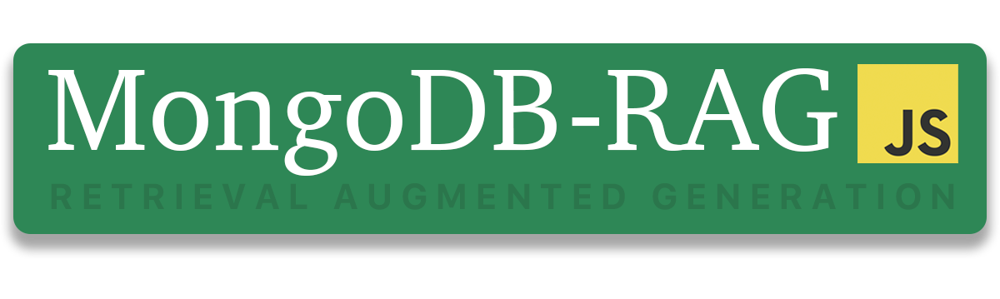

---



# MongoDB-RAG


## Overview
MongoDB-RAG (Retrieval Augmented Generation) is an NPM module that simplifies vector search using MongoDB Atlas. This library enables developers to efficiently perform similarity search, caching, batch processing, and indexing for fast and accurate retrieval of relevant data.

## 🚀 Features
- **Vector Search**: Efficiently retrieves similar documents using MongoDB's Atlas Vector Search.
- **Dynamic Database & Collection Selection**: Supports flexible selection of multiple databases and collections.
- **Batch Processing**: Handles bulk processing of documents with retry mechanisms.
- **Index Management**: Ensures necessary indexes are available and optimized.
- **Caching Mechanism**: Provides in-memory caching for frequently accessed data.
- **Advanced Chunking**: Supports **sliding window**, **semantic**, and **recursive** chunking strategies.
- **CLI for Scaffolding RAG Apps**

---

## **🚀 Getting Started**

### **1️⃣ Install the Package**
```sh
npm install mongodb-rag dotenv
```

### **2️⃣ Set Up MongoDB Atlas**
1. **Initialize Your App** using the CLI:
   ```sh
   npx mongodb-rag init
   ```
   This will guide you through setting up your MongoDB connection and save the configuration to `.mongodb-rag.json`. Make sure to add `.mongodb-rag.json` to your `.gitignore` file to keep your credentials secure.

   ```bash
   % npx mongodb-rag init
✔ Enter your MongoDB connection string: · mongodb+srv://<username>:<password>@cluster0.mongodb.net/
✔ Enter the database name: · mongodb-rag
✔ Enter the collection name: · documents
✔ Select an embedding provider: · openai
✔ Enter your API key (skip if using Ollama): · your-embedding-api-key
✔ Enter the model name: · text-embedding-3-small
✔ Enter the embedding dimensions: · 1536
✅ Configuration saved to .mongodb-rag.json

🔍 Next steps:
1. Run `npx mongodb-rag test-connection` to verify your setup
2. Run `npx mongodb-rag create-index` to create your vector search index
```

2. **Create a MongoDB Atlas Cluster** ([MongoDB Atlas](https://www.mongodb.com/atlas))

3. **Enable Vector Search** under Indexes:
   ```json
   {
     "definition": {
       "fields": [
         { "path": "embedding", "type": "vector", "numDimensions": 1536, "similarity": "cosine" }
       ]
     }
   }
   ```
or, use the CLI to create the index:
   ```sh
   npx mongodb-rag create-index
   ```
4. **Create a `.env` File** using:
   ```sh
   npx mongodb-rag create-env
   ```
   This command reads the `.mongodb-rag.json` file and generates a `.env` file with the necessary environment variables.

### **3️⃣ Quick Start with CLI**
You can generate a fully working RAG-enabled app with **MongoDB Atlas Vector Search** using:

```sh
npx mongodb-rag create-rag-app my-rag-app
```

This will:
- Scaffold a new **CRUD RAG app** with Express and MongoDB Atlas.
- Set up **environment variables** for **embedding providers**.
- Create API routes for **ingestion, search, and deletion**.

Then, navigate into your project and run:

```sh
cd my-rag-app
npm install
npm run dev
```

### **4️⃣ Initialize MongoRAG**
```javascript
import { MongoRAG } from 'mongodb-rag';
import dotenv from 'dotenv';
dotenv.config();

const rag = new MongoRAG({
    mongoUrl: process.env.MONGODB_URI,
    database: 'my_rag_db',  // Default database
    collection: 'documents', // Default collection
    embedding: {
        provider: process.env.EMBEDDING_PROVIDER,
        apiKey: process.env.EMBEDDING_API_KEY,
        model: process.env.EMBEDDING_MODEL,
        dimensions: 1536
    }
});
await rag.connect();
```

### **5️⃣ Ingest Documents**
```javascript
const documents = [
    { id: 'doc1', content: 'MongoDB is a NoSQL database.', metadata: { source: 'docs' } },
    { id: 'doc2', content: 'Vector search is useful for semantic search.', metadata: { source: 'ai' } }
];

await rag.ingestBatch(documents, { database: 'dynamic_db', collection: 'dynamic_docs' });
console.log('Documents ingested.');
```

### **6️⃣ Perform a Vector Search**
```javascript
const query = 'How does vector search work?';

const results = await rag.search(query, {
    database: 'dynamic_db',
    collection: 'dynamic_docs',
    maxResults: 3
});

console.log('Search Results:', results);
```

### **7️⃣ Close Connection**
```javascript
await rag.close();
```

---

## **⚡ Additional Features**

### **🌍 Multi-Database & Collection Support**
Store embeddings in multiple **databases and collections** dynamically.
```javascript
await rag.ingestBatch(docs, { database: 'finance_db', collection: 'reports' });
```

### **🔎 Hybrid Search (Vector + Metadata Filtering)**
```javascript
const results = await rag.search('AI topics', {
    database: 'my_rag_db',
    collection: 'documents',
    maxResults: 5,
    filter: { 'metadata.source': 'ai' }
});
```

---

## **🧪 Testing**
Run tests using:
```sh
npm test
```
Run in watch mode:
```sh
npm run test:watch
```
Check test coverage:
```sh
npm run test:coverage
```

---


## **🤝 Contributing**
Contributions are welcome! Please fork the repository and submit a pull request.

---

## **📜 License**
This project is licensed under the MIT License.

## **💡 Examples**

- For more examples, check our [examples directory](https://github.com/mongodb-developer/mongodb-rag/tree/main/examples).
    

## 🔗 Links

- CLI Reference
- [Documentation](https://mongodb-developer.github.io/mongodb-rag/)
- [GitHub Repository](https://github.com/mongodb-developer/mongodb-rag)
- [Bug Reports](https://github.com/mongodb-developer/mongodb-rag/issues)
- [MongoDB Atlas](https://www.mongodb.com/cloud/atlas)

