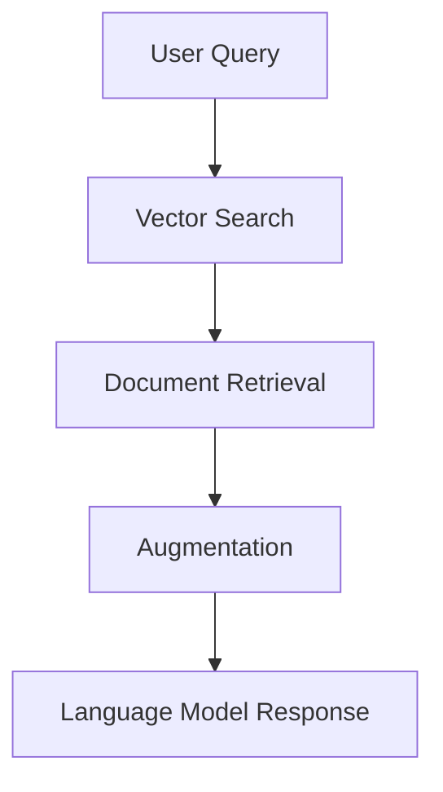

## Introduction to RAG

Retrieval-Augmented Generation (RAG) is a powerful approach that combines information retrieval with language generation. It enhances the capabilities of language models by providing them with relevant context from external data sources, leading to more accurate and contextually aware responses.

## Key Components of RAG

### 1. User Query

The process begins with a user query, which is a question or prompt that requires a response. This query is the starting point for the RAG workflow.

### 2. Vector Search

- **Vector Embeddings**: The user query and documents in the database are converted into vector embeddings. These embeddings capture the semantic meaning of the text.
- **Similarity Search**: Using vector search techniques, the system retrieves documents that are semantically similar to the user query. This is achieved by calculating the distance between the query vector and document vectors.

### 3. Document Retrieval

- **Candidate Selection**: The system selects a set of candidate documents based on their similarity scores. These documents are considered relevant to the user's query.
- **Contextual Information**: The retrieved documents provide additional context that can be used to generate a more informed response.

### 4. Augmentation

- **Prompt Construction**: The retrieved documents are injected into the language model's prompt. This augmented prompt includes both the original user query and the contextual information from the documents.
- **Enhanced Context**: By providing the language model with this enriched context, it can generate responses that are more accurate and relevant.

### 5. Language Model Response

- **Response Generation**: The language model processes the augmented prompt and generates a response. This response is informed by both the user's query and the additional context provided by the retrieved documents.
- **Output Delivery**: The final response is delivered to the user, completing the RAG workflow.

## Advantages of RAG

- **Improved Accuracy**: By leveraging external data, RAG can produce more accurate and contextually relevant responses.
- **Scalability**: RAG can handle large datasets and complex queries, making it suitable for a wide range of applications.
- **Flexibility**: The approach can be adapted to various domains and use cases, from customer support to content generation.

## Conclusion

RAG represents a significant advancement in the field of natural language processing, offering a robust framework for generating high-quality responses by combining retrieval and generation techniques. By understanding the components and workflow of RAG, developers can harness its potential to build more intelligent and responsive applications.